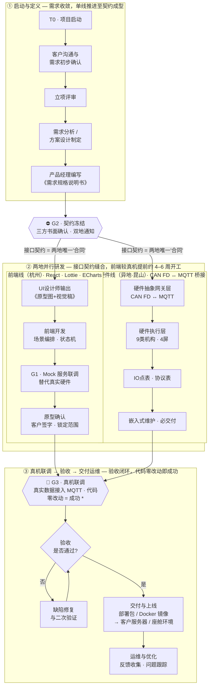

# dev-flow.md — 两地软硬件协同开发流程（Seam S2）

> **来源:** 客户/团队 PPT《智能座舱软件开发流程》—— 一页流程图。
> **副标题（三句话总纲）:** **两地并行 · 契约控风险 · 三道关键闸门。**
> **它治理什么:** 杭州（软件）↔ 昆山（嵌入/硬件）端到端的协同研发流程。这是项目最高杠杆的缝（S2），也是 PMO 必须盯死的协同主线。
> **配套文档:** 缝合规则见 `two-site.md`；契约冻结的变更走 `change-control.md`（F2）；整体排期见 `gantt.md`。

> ⚠️ **关于时间（重要）：本流程不绑定固定周次。** 不变的是**顺序 + 三道闸门（G1/G2/G3）+ 相对提前量**；绝对周次按每个项目自身的周期定义重新标定（见 §4 的自填日历表）。原 PPT 的 `W0 / W2 / W19` 只是某一项目的**示例标定**，换项目只改日历列、流程结构不动。

---

## 0. 一句话读懂这张图

一张图咬合**两条叙事**：
- **横向 = 节奏线（按闸门，不按周次）**：`T0 启动 → G1 Mock启动 → G2 契约冻结 → … 两地并行开发 … → G3 真机联调 → 交付上线`。
- **纵向 = 三段分区**：① 启动与定义（单线）→ ② 两地并行研发（双线）→ ③ 真机联调·验收·交付运维（收口）。

核心赌注：**前端不等硬件**，靠接口契约提前开工（相对提前量约 **4–6 周**，随项目周期缩放）；真机一次接入，**代码零改动 = 契约设计成功**。

---

## 1. 流程全图（可直接调用）

> **\* 脚注（图上原文）:** 代码零改动 = 契约设计成功；**若必须改动，回退至 G2（契约冻结）双地书面确认后再继续。**

---

## 2. 三个阶段逐段解读

### ① 启动与定义 — *单线推进，直到契约成型*
`项目启动 → 客户沟通与需求初步确认 → 立项评审 → 需求分析/方案设计 → 产品经理编写《需求规格说明书》`

- **为什么单线**：契约没成型之前，并行就是赌博。需求必须先**收敛**到一份可签字的规格书，才允许两地分头开工。
- **PMO 动作**：盯需求收敛速度，别让"需求还在飘"拖过 G2；规格书是 G2 契约冻结的输入物。

### ⛔ G2 · 契约冻结（= 项目命门 / F2 冻结线）
- **冻结对象**（与 `two-site.md` 的四张契约一致）：WebSocket 报文格式、场景触发 API、IO 点表、CAN FD 协议。
- **进入条件**：规格书完成、**三方书面确认 · 双地通知**。口头不算、单地签字不算。
- **冻结后**：任何改动**必须**走 `change-control.md`（F2），**杭州 + 昆山并行双签**，并广播"契约升级 vX，两地同步改 Mock/代码"。

### ② 两地并行研发 — *接口契约缝合，前端不等硬件，相对提前约 4–6 周*
> **接口契约 = 两地唯一"合同"。** 两条线只在契约处相交，各自向内推进。

| | **前端线（杭州）** | **硬件线（异地·昆山）** |
|---|---|---|
| 技术栈 | React · Lottie · ECharts；状态机 | CAN FD ↔ MQTT 桥接 |
| 步骤 | UI 出《原型图+视觉稿》→ 前端开发（场景编排·状态机）→ **G1 Mock 服务联调（替代真实硬件）** → 原型确认（客户签字·锁定范围） | 硬件抽象网关层（CAN FD↔MQTT）→ 硬件执行层（9类机构·4屏）→ IO点表·协议表 → 嵌入式维护·必交付 |
| 关键点 | 用 Mock 顶替真实硬件，所以能**较真机提前开工**（相对提前量按项目周期缩放，参考 4–6 周） | 网关层把硬件抽象成 MQTT，前端因此**无需感知** CAN FD 细节 |

- **"原型确认·客户签字·锁定范围"** 是 S1（供给缝）的范围闸门——防客户把 C 类需求偷偷升成 A 类（scope creep < 10%）。
- **PMO 必盯的协同风险**：**Mock ≠ 真实硬件**。昆山每次更新 IO点表/协议表，必须**同步回灌**杭州的 Mock，否则 G3 真机一接入就炸。

### ③ 真机联调 → 验收 → 交付运维 — *验收闭环，代码零改动即成功*
`G3 真机联调（真实数据接入 MQTT）→ 验收是否通过? →（否）缺陷修复与二次验证↺ →（是）交付与上线 → 运维与优化`

- **验收成功的判据**：真机接入后**前/后端代码零改动**就能跑通。要改 = 契约当初没设计对 → **回退 G2 重新双地书面确认**。
- **闭环**：验收不通过不是终点，走"缺陷修复→二次验证→重新验收"直到通过。
- **交付物**：部署包 / Docker 镜像 → 客户服务器 / 座舱环境，随后进入运维（反馈收集·问题跟踪）。

---

## 3. 三道关键闸门（与 `two-site.md` 的 G1–G3 对齐）

> 闸门以**进入条件**定义，不以周次定义。周次是每个项目把闸门落到自身日历后的结果。

| 闸门 | 本图节点 | 进入条件（触发） | 通过判据 / PMO 盯什么 |
|------|----------|------------------|------------------------|
| **G1 — Mock 启动** | Mock 服务联调 | 接口契约**草案**（规格书初稿）就绪 | 杭州不等硬件即开工；盯 Mock 是否按契约草案搭起来 |
| **G2 — 契约冻结** | ⛔ 契约冻结 | 规格书完成 + 三方书面确认 + 双地通知 | **命门**。冻结后只能走 F2 变更（双地并签） |
| **G3 — 真机联调** | 🎯 真机联调 | 硬件网关 + IO点表交付，Mock 与真实 IO 已对齐 | 真实数据进 MQTT；**代码零改动 = 成功**，否则回退 G2 |

---

## 4. 把闸门落到“本项目”的日历（每项目自填）

> 具体时间不固定。每个项目用自身周期把三道闸门标定成实际周次/日期，**结构与顺序不变**。复制下表逐项目填写（Bitable 里建“项目日历”视图）。

| 锚点 | 含义 | 前置/触发 | **本项目周次/日期（自填）** |
|------|------|-----------|-----------------------------|
| **T0** | 项目启动 | 合同生效 / 立项 | ____ |
| **G1** | Mock 启动 | 契约草案就绪 | ____ |
| **G2** | 契约冻结（F2） | 规格书三方书面确认 | ____ |
| — | 两地并行开发窗口 | G2 之后 | ____ ~ ____ |
| **G3** | 真机联调 | 网关 + IO点表就绪、Mock 对齐 | ____ |
| **交付** | 上线 | 验收通过 | ____ |
| **运维** | 优化 | 上线后 | ____ |

**示例标定（本 demo 项目，仅供参考）：** T0=W0、G1=W1、G2=W2、并行窗口 W2–W18、G3=W19、交付上线后续。

**与本 demo 主排期（CLAUDE.md / gantt.md）的口径对齐说明：**
- **G2 契约冻结** ↔ 宪法 **F2 接口契约冻结（本 demo ~W2–W3）**：一致。
- **G3 真机联调** 是**软件侧首次接入真机**的锚点；与宪法 **M6 预验收 / 系统级整合（本 demo W22–26）不是同一件事**。理解为：软件在 G3 先行单点接入 MQTT，系统级整合与预验收延续到主排期的整合窗口。
- **建议**：在 Bitable 里把 G1/G2/G3 设为里程碑字段、用“项目日历”视图填实际周次，并与主 Gantt 的里程碑建关联，避免两地对“哪个时点算数”产生歧义。

---

## 5. 落到 Feishu（怎么用起来）

> **导入种子:** `templates/dev-flow-tracker.csv` —— 19 个流程节点 + 三道闸门（G1/G2/G3）；时间用**相对锚点**列，另留**项目周次（自填）**空列；字段已对齐 Bitable，导入后维护 Bitable 副本，勿改种子。

- **Bitable**：把本图三个阶段拆成任务分组（启动/并行/收口）；G1·G2·G3 设为里程碑字段；建一个“项目日历”视图专门填实际周次；前端线/硬件线各建一个看板视图。
- **Approval**：G2 契约冻结 = 一条带**并行分支**的审批（杭州+昆山同时签）；后续 F2 变更复用同一审批模板。
- **Wiki**：本 `dev-flow.md` + 流程图归档，作为新成员"两地协同"第一读物。
- **Automation**：用日报摘要提醒"Mock 与 IO点表是否同步"（这是 G1→G3 之间最容易断的缝）。
</content>
