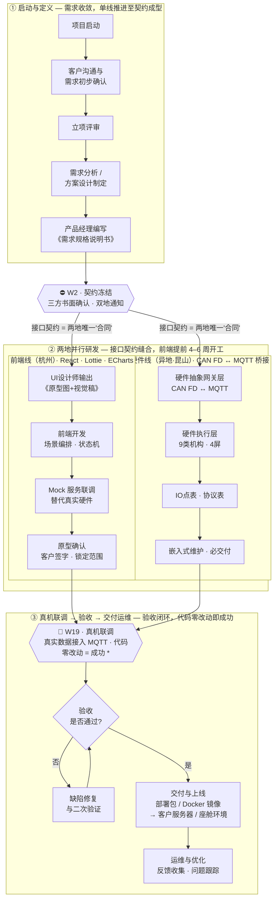

# dev-flow.md — 两地软硬件协同开发流程（Seam S2）

> **来源:** 客户/团队 PPT《智能座舱软件开发流程》—— 一页流程图。
> **副标题（三句话总纲）:** **两地并行 · 契约控风险 · 三道关键闸门。**
> **它治理什么:** 杭州（软件）↔ 昆山（嵌入/硬件）端到端的协同研发流程。这是项目最高杠杆的缝（S2），也是 PMO 必须盯死的协同主线。
> **配套文档:** 缝合规则见 `two-site.md`；契约冻结的变更走 `change-control.md`（F2）；整体排期见 `gantt.md`。

---

## 0. 一句话读懂这张图

一张图咬合**两条叙事**：
- **横向 = 时间线**：`W0 → W1 Mock启动 → W2 契约冻结 → … 两地并行开发 … → W19 真机联调 → 交付上线`。
- **纵向 = 三段分区**：① 启动与定义（单线）→ ② 两地并行研发（双线）→ ③ 真机联调·验收·交付运维（收口）。

核心赌注：**前端不等硬件**，靠接口契约提前 **4–6 周**开工；真机一次接入，**代码零改动 = 契约设计成功**。

---

## 1. 流程全图（可直接调用）

> **\* 脚注（图上原文）:** 代码零改动 = 契约设计成功；**若必须改动，回退至 W2 双地书面确认后再继续。**

---

## 2. 三个阶段逐段解读

### ① 启动与定义 — *单线推进，直到契约成型*
`项目启动 → 客户沟通与需求初步确认 → 立项评审 → 需求分析/方案设计 → 产品经理编写《需求规格说明书》`

- **为什么单线**：契约没成型之前，并行就是赌博。需求必须先**收敛**到一份可签字的规格书，才允许两地分头开工。
- **PMO 动作**：盯需求收敛速度，别让"需求还在飘"拖到 W2 之后；规格书是 W2 契约冻结的输入物。

### ⛔ W2 · 契约冻结（= 项目命门 / F2 冻结线）
- **冻结对象**（与 `two-site.md` 的四张契约一致）：WebSocket 报文格式、场景触发 API、IO 点表、CAN FD 协议。
- **冻结条件**：**三方书面确认 · 双地通知**。口头不算、单地签字不算。
- **冻结后**：任何改动**必须**走 `change-control.md`（F2），**杭州 + 昆山并行双签**，并广播"契约升级 vX，两地同步改 Mock/代码"。

### ② 两地并行研发 — *接口契约缝合，前端不等硬件，提前 4–6 周*
> **接口契约 = 两地唯一"合同"。** 两条线只在契约处相交，各自向内推进。

| | **前端线（杭州）** | **硬件线（异地·昆山）** |
|---|---|---|
| 技术栈 | React · Lottie · ECharts；状态机 | CAN FD ↔ MQTT 桥接 |
| 步骤 | UI 出《原型图+视觉稿》→ 前端开发（场景编排·状态机）→ **Mock 服务联调（替代真实硬件）** → 原型确认（客户签字·锁定范围） | 硬件抽象网关层（CAN FD↔MQTT）→ 硬件执行层（9类机构·4屏）→ IO点表·协议表 → 嵌入式维护·必交付 |
| 关键点 | 用 Mock 顶替真实硬件，所以能**提前 4–6 周开工** | 网关层把硬件抽象成 MQTT，前端因此**无需感知** CAN FD 细节 |

- **"原型确认·客户签字·锁定范围"** 是 S1（供给缝）的范围闸门——防客户把 C 类需求偷偷升成 A 类（scope creep < 10%）。
- **PMO 必盯的协同风险**：**Mock ≠ 真实硬件**。昆山每次更新 IO点表/协议表，必须**同步回灌**杭州的 Mock，否则 W19 真机一接入就炸。

### ③ 真机联调 → 验收 → 交付运维 — *验收闭环，代码零改动即成功*
`W19 真机联调（真实数据接入 MQTT）→ 验收是否通过? →（否）缺陷修复与二次验证↺ →（是）交付与上线 → 运维与优化`

- **验收成功的判据**：真机接入后**前/后端代码零改动**就能跑通。要改 = 契约当初没设计对 → **回退 W2 重新双地书面确认**。
- **闭环**：验收不通过不是终点，走"缺陷修复→二次验证→重新验收"直到通过。
- **交付物**：部署包 / Docker 镜像 → 客户服务器 / 座舱环境，随后进入运维（反馈收集·问题跟踪）。

---

## 3. 三道关键闸门（与 `two-site.md` 的 G1–G3 对齐）

| 闸门 | 本图节点 | 周次 | 含义 / PMO 盯什么 |
|------|----------|------|-------------------|
| **G1 — Mock 启动** | Mock 服务联调 | **W1** | 杭州不等硬件即开工；盯 Mock 是否按契约草案搭起来 |
| **G2 — 契约冻结** | ⛔ W2·契约冻结 | **W2** | **命门**。三方书面+双地通知；冻结后只能走 F2 变更 |
| **G3 — 真机联调** | 🎯 W19·真机联调 | **W19** | 真实数据进 MQTT；**代码零改动 = 成功**，否则回退 W2 |

---

## 4. 与项目宪法（CLAUDE.md / gantt.md）的口径对齐

> 本图是**软件研发生命周期视角**，与 30 周主排期（硬件驱动的关键路径）是**两个镜头**，需注意周次口径：

- **W2 契约冻结** ↔ 宪法 **F2 接口契约冻结（~W2–W3）**：一致。
- **W19 真机联调** 是**软件侧首次接入真机**的时点；与宪法 **M6 预验收（W26）/ 系统级整合（W22–26）不是同一件事**。理解为：软件在 W19 先行单点接入 MQTT，系统级整合与预验收延续至 W22–26。
- **建议**：在 Bitable 里给该流程的里程碑节点（W1/W2/W19）单独打标，并与主 Gantt 的 M1–M7 建立关联视图，避免两地对"哪个 W19/W22 算数"产生歧义。

---

## 5. 落到 Feishu（怎么用起来）

- **Bitable**：把本图三个阶段拆成任务分组（启动/并行/收口），W1·W2·W19 设为里程碑字段；前端线/硬件线各建一个看板视图。
- **Approval**：W2 契约冻结 = 一条带**并行分支**的审批（杭州+昆山同时签）；后续 F2 变更复用同一审批模板。
- **Wiki**：本 `dev-flow.md` + 流程图归档，作为新成员"两地协同"第一读物。
- **Automation**：用日报摘要提醒"Mock 与 IO点表是否同步"（这是 G1→G3 之间最容易断的缝）。
</content>
</invoke>
