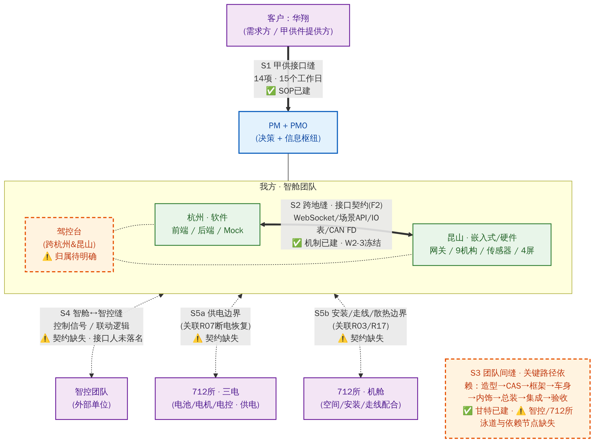
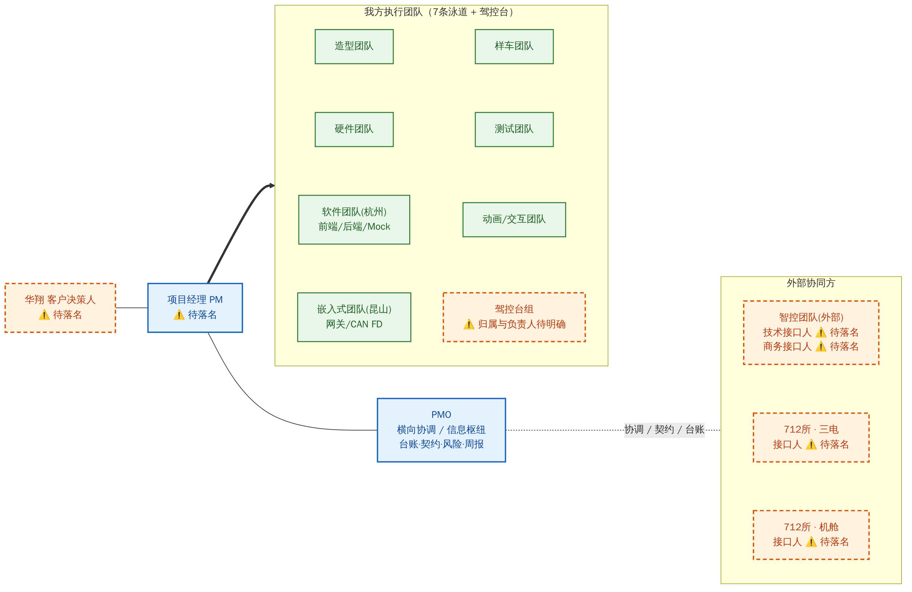
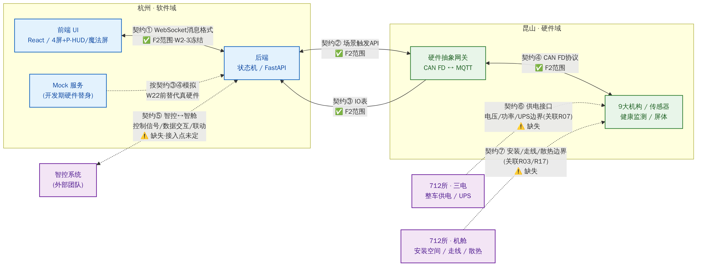
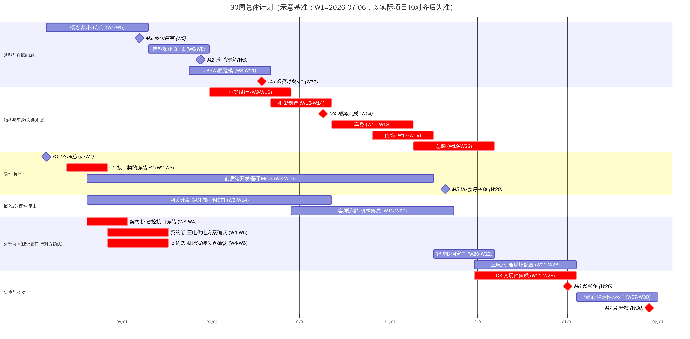
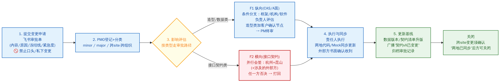

# 华翔 NICE 智能座舱车展 Demo · PMO 管理体系（V2）
## —— 关注问题清单与下一步行动策略

| 文档信息 | 内容 |
|---|---|
| 版本 | V2.0 |
| 日期 | 2026-07-02 |
| 维护 | PMO |
| 读者 | PM、客户接口人、智舱（杭州/昆山）负责人、智控团队接口人、712所接口人 |
| 数据说明 | 本文是**结构与决策文档**；三张台账（接口/风险/里程碑）的活数据以 **飞书 Bitable** 为唯一事实来源，本文不重复维护动态数据 |

---

## 0. 摘要（一页读懂）

**现状判断：** 项目的内部管理体系已经建立——三条缝（S1 甲供 / S2 杭昆跨地 / S3 关键路径）、两条冻结线（F1 数据 / F2 接口契约）、17 项风险登记、周报飞轮均有章可循。但**实际组织已经扩展为四方协作**（客户华翔、我方智舱团队、外部智控团队、712所三电及机舱），新增的两条**跨组织外部缝（S4、S5）目前没有任何治理覆盖**：无接口契约、无接口人、无排期、无升级路径。项目约 70% 的延期风险在"缝"上，而当前最危险的缝恰恰是没人管的这两条。

**三件最优先的事：**

1. **补齐并冻结外部接口契约（契约⑤⑥⑦）**——这是 F2 冻结逻辑的直接延伸，拖过 W2–3 冻结窗口，代价将在 W22–26 集成期十倍偿还；
2. **外部依赖节点进入甘特基线**——智控、712所的交付/配合节点必须有周次和验收口径，否则关键路径监控对最不可控的两方是盲的；
3. **人员落名**——智控/712所接口人、驾控台负责人、17+4 项风险的 Owner，全部落到具体人名。**没有名字的责任等于没有责任。**

**图示索引：** 图1 组织协作拓扑 · 图2 团队组织架构 · 图3 技术系统拓扑 · 图4 30周时间计划 · 图5 变更控制流程

---

## 1. 项目基本盘

- **项目：** 华翔 NICE 智能座舱车展 Demo，**30 周**总周期，68 项演示功能按 **A/B/C 三级**分级（A=真实硬件必须实现；B=效果 ≥90%；C=概念呈现，可用动画/模型）。
- **范围红线：** 防止客户将 C 级功能悄悄升级为 A 级而不增加时间与预算，范围蔓延目标 **<10%**。
- **关键路径：** 造型确认 → CAS → 框架（W14）→ 车身 → 内饰 → 总装（W22）→ 集成（W26）→ 预验收 → 终验收（W30）。**此链任何一环滑动，M7 就滑动。**

### 1.1 里程碑（M1–M7）

| ID | 里程碑 | 周次 | 通过标准（门禁） |
|----|--------|------|------------------|
| M1 | 概念评审 | W5 | ≥1 个造型方向获客户**书面**确认 |
| M2 | 造型锁定 | W8 | 3 选 1，深化并确认 |
| M3 | 数据冻结（**F1**） | W11 | CAS / A 面完成，此后无重大变更 |
| M4 | 框架完成 | W14 | 车身框架完成，可开始装配（**关键路径核心**） |
| M5 | UI/软件主体 | W20 | 屏幕 UI/UX 主体完成，交互逻辑就绪 |
| M6 | 预验收 | W26 | A 类 100% · B 类 ≥90% · 稳定性 8h×3 零 A 类故障 |
| M7 | 终验收 | W30 | 验收通过，可交付 |

### 1.2 两条冻结线

| 冻结线 | 冻结内容 | 时点 | 风险形态 |
|--------|----------|------|----------|
| **F1 — CAS/A 面数据** | 造型、CAS、A 面（CATIA，0.05mm） | ~M3/W11 | **纵向**连锁：造型→框架→机构→软件 |
| **F2 — 接口契约** | WebSocket / 场景 API / IO 表 / CAN FD（**本版扩展：+智控、三电、机舱契约⑤⑥⑦**） | ~W2–3 | **横向**跨地/跨组织：一方变更另一方不知 → 集成期爆雷 |

> **铁律：冻结后，无"评估+书面审批"= 不变更。** 禁止口头变更、禁止私下变更。F2 类变更必须相关各方**并行会签**。

---

## 2. 组织与协作拓扑（系统拓扑图）

**图 1 · 组织协作拓扑（五条缝总览）**

### 2.1 五条缝：现状与差距

| 缝 | 双方 | 治理机制 | 现状 | 差距 |
|----|------|----------|------|------|
| **S1** 甲供接口 | 华翔 ↔ 我方 | 接口清单 SOP：14 项甲供件，15 个工作日交付义务，四状态台账，L1–L4 催办升级 | ✅ 机制已建 | 台账当前状态需每周核对（见问题 Q5） |
| **S2** 跨地协同 | 杭州（软件）↔ 昆山（嵌入式/硬件） | 接口契约（F2）+ Mock-first 并行开发 + 三道闸门 G1/G2/G3 | ✅ 机制已建 | 契约按期冻结待执行 |
| **S3** 团队间关键路径 | 7 条泳道团队之间 | 依赖图 + 甘特基线 + 周度 buffer 监控 | ✅ 机制已建 | ⚠️ 智控/712所**泳道与依赖节点缺失** |
| **S4** 智舱 ↔ 智控 | 我方智舱 ↔ 智控团队（**外部**） | —— | ❌ **空白** | 无契约、无接口人、无排期、无升级路径 |
| **S5** 智舱 ↔ 712所 | 我方智舱/整车 ↔ 712所三电、机舱 | —— | ❌ **空白** | 供电边界（关联 R07）、安装/走线/散热边界（关联 R03/R17）均未书面化 |

### 2.2 外部缝的特殊性（为什么 S4/S5 比内部缝更危险）

1. **无行政指挥权**——智控是外部单位、712所是院所体制，我方无法用内部管理手段驱动其排期与优先级；唯一抓手是**书面契约 + 合同/协议层升级路径**。
2. **不在同一工具体系内**——飞书审批的并行会签、自动化催办、Bitable 单一事实来源，对外部方默认失效，需要专门设计接入或替代方式。
3. **问题暴露晚**——外部接口问题通常在集成期（W22–26）才炸出来，届时关键路径已无缓冲。

---

## 3. 团队组织架构与协同人员

**图 2 · 团队组织架构（⚠️ 虚线橙框 = 待落名/待明确项）**

### 3.1 协同人员矩阵（接口人清单）

> **规则：每个组织必须有书面指定的唯一技术接口人；外部单位另需商务/行政接口人。杜绝"谁都能答应、谁都不算数"。**
> 下表落名后由 PMO 录入 Bitable 并在启动会上书面确认；任何变更需通知 PMO 更新。

| 组织/团队 | 角色 | 职责边界 | 姓名 | 联系方式 | 状态 |
|-----------|------|----------|------|----------|------|
| 华翔（客户） | 决策人 | 造型/范围/验收签字 | —— | —— | ⚠️ 待落名 |
| 华翔（客户） | 甲供接口人 | 14 项甲供件资料交付 | —— | —— | ⚠️ 待落名 |
| 我方 | 项目经理 PM | 全项目决策 | —— | —— | ⚠️ 待落名 |
| 我方 | PMO | 横向协调、台账、契约、风险、周报 | —— | —— | ⚠️ 待落名 |
| 智舱·杭州 | 软件负责人 | 前端/后端/Mock；契约①②的杭州侧会签人 | —— | —— | ⚠️ 待落名 |
| 智舱·昆山 | 硬件负责人 | 网关/机构/传感器/屏体；契约③④的昆山侧会签人 | —— | —— | ⚠️ 待落名 |
| 智舱 | 驾控台负责人 | 驾控台结构+软件+联动（跨杭昆） | —— | —— | ⚠️ 归属先明确（见 Q4） |
| 智控团队（外部） | 技术接口人 | 契约⑤内容与会签；联调窗口执行 | —— | —— | ⚠️ 待落名 |
| 智控团队（外部） | 商务/行政接口人 | 排期承诺、L3/L4 升级对口 | —— | —— | ⚠️ 待落名 |
| 712所 | 三电接口人 | 契约⑥供电方案；现场配合 | —— | —— | ⚠️ 待落名 |
| 712所 | 机舱接口人 | 契约⑦安装/走线/散热边界 | —— | —— | ⚠️ 待落名 |

### 3.2 跨组织 RACI（核心事项）

R=执行 · A=负责拍板 · C=须咨询 · I=须知会

| 事项 | PM | PMO | 杭州 | 昆山 | 智控(外) | 712所 | 客户 |
|------|----|----|------|------|----------|-------|------|
| 接口契约①–④（杭昆）变更 | A | R(流程) | C(会签) | C(会签) | I | I | I |
| 契约⑤（智控↔智舱）制定与变更 | A | R(流程) | C(会签) | C(会签) | **C(会签)** | I | I |
| 契约⑥（三电供电）制定与变更 | A | R(流程) | I | C(会签) | I | **C(会签)** | I |
| 契约⑦（机舱边界）制定与变更 | A | R(流程) | I | C(会签) | I | **C(会签)** | I |
| 造型/CAS 数据变更（F1） | A | R(流程) | C | C | I | C(涉及机舱时) | C(书面确认) |
| 30 周基线与外部节点排期 | A | R | C | C | C | C | I |
| 联调窗口（W20–22 智控 / W22–26 三电机舱） | A | R(协调) | R | R | R | R | I |
| 范围变更（C→A 升级等） | A | R(评估) | C | C | C | C | **A(共同)** |
| 周报/RAG 发布 | I | R | I | I | I(涉及段落) | I(涉及段落) | I |

---

## 4. 技术系统拓扑与接口契约

**图 3 · 技术系统拓扑（契约①–④已纳入 F2；⑤⑥⑦为本版新增、当前缺失）**

**架构意图：** 接口驱动、Mock 先行、两地并行。杭州基于 Mock 提前开发；W22 起真实硬件接入 MQTT，若契约正确则**前后端零代码改动**——这是 G3 的成功判据。

### 4.1 接口契约清单

| # | 契约 | 双方 | 内容 | 状态 | 冻结目标 |
|---|------|------|------|------|----------|
| ① | WebSocket 消息格式 | 后端 → 前端 | 健康数据字段/类型/单位 | ✅ F2 范围，机制已建 | W2–3（G2） |
| ② | 场景触发 API | 后端 → 嵌入式 | S1–S4 场景触发、复位、状态 | ✅ F2 范围 | W2–3（G2） |
| ③ | IO 表 | 嵌入式 → 前后端 | 每个信号的名称/类型/地址/量程/CAN FD ID | ✅ F2 范围 | W2–3（G2） |
| ④ | CAN FD 协议 | 嵌入式 → 后端 | 9 大机构命令 ID、帧格式、时序 | ✅ F2 范围 | W2–3（G2） |
| ⑤ | **智控 ↔ 智舱接口** | 智控(外) ↔ 杭州后端/昆山网关 | 控制信号、数据交互协议、驾控台联动逻辑、**接入点（后端还是网关）** | ❌ **缺失** | **W3–4（建议）** |
| ⑥ | **三电供电接口** | 712所三电 → 昆山硬件 | 电压/功率/接口形式/UPS 边界（直接关联 R07 断电恢复） | ❌ **缺失** | **W4–6（建议）** |
| ⑦ | **机舱安装边界** | 712所机舱 → 昆山硬件 | 安装空间、走线通道、散热条件、结构安装点（关联 R03 域控散热 / R17 光纤走线） | ❌ **缺失** | **W4–6（建议）** |

### 4.2 契约治理规则（F2 扩展）

1. 每份契约有**版本号、冻结日期、双方签字**；冻结后变更走 §6 变更控制，相关方**并行会签**。
2. **外部方会签方式**：优先邀请外部协作者进飞书审批；走不通则退化为"邮件/盖章 PDF 回执 + PMO 录入 Bitable"。**签字形式可以妥协，"双方书面、可追溯"不能妥协。**
3. 契约③④任何更新必须**同步更新杭州 Mock**——Mock 与真实硬件的一致性是 G3 成败的前提；争取 W22 前完成**一次提前集成**。
4. 契约变更**只有在"所有受影响方已同步"确认后才算关闭**——这是防集成爆雷的最后一道闸。

---

## 5. 时间计划（30 周）

**图 4 · 30 周总体计划（红色 = 关键路径/关键动作；示意基准 W1=2026-07-06，须与实际项目 T0 对齐后生效 → 见问题 Q1）**

### 5.1 三道闸门（S2 跨地缝的节拍器）

| 闸门 | 周次 | 含义 | 成功判据 |
|------|------|------|----------|
| **G1** Mock 启动 | W1 | 杭州不等硬件直接开发 | Mock 服务可用 |
| **G2** 契约冻结 | W2–3 | 契约①–④三方书面签认（**命门**）；**本版要求契约⑤⑥⑦在 W3–6 完成同等冻结** | 全部契约有版本号+签字 |
| **G3** 真硬件集成 | W22–26 | 真实数据接入 MQTT | **前后端零代码改动** |

### 5.2 外部依赖节点（必须进入基线的清单）

> **规则：外部承诺没有进基线 = 不存在。** 下表各节点须与对方书面确认周次后录入 Bitable 甘特（外部协同泳道），纳入周度 buffer 监控。

| 节点 | 依赖方 | 我方需要什么 | 建议窗口 | 验收口径 | 状态 |
|------|--------|--------------|----------|----------|------|
| 契约⑤签认 | 智控 | 接口定义联合评审+会签 | W3–4 | 版本化契约文本+双方签字 | ⚠️ 待排期 |
| 契约⑥签认 | 712所三电 | 供电方案（电压/功率/UPS） | W4–6 | 同上 | ⚠️ 待排期 |
| 契约⑦签认 | 712所机舱 | 安装/走线/散热边界图纸 | W4–6 | 同上 | ⚠️ 待排期 |
| 智控系统可联调版本 | 智控 | 可对接的软件/硬件版本 | ≤W20 | 按契约⑤联调用例通过 | ⚠️ 待排期 |
| 智控联调窗口 | 智控+杭昆 | 联合联调人力到场/远程 | W20–22 | 联动场景全通过 | ⚠️ 待排期 |
| 三电供电到位 | 712所三电 | 整车供电+UPS 就绪 | ≤W22 | 断电恢复演练通过（R07） | ⚠️ 待排期 |
| 机舱现场配合 | 712所机舱 | 安装/走线现场支持 | W22–26 | 机构安装完成、走线隐蔽合格 | ⚠️ 待排期 |

### 5.3 计划管理规则

1. **T0 对齐**：本文所有日期基于"W1=2026-07-06"的示意假设，PM 确认实际 T0 后由 PMO 统一换算并更新 Bitable 甘特（见 Q1）。
2. **每周核对关键路径 buffer 消耗**（量化到天），进周报第 3 节。
3. 30 周高度压缩，**三个最可能的延误源**盯死：甲供样件交付延迟（S1/R02）、A 面冻结延迟压缩内饰加工（F1/R08）、软件 UI 依赖交互设计 Figma（跨地跨专业缝）。

---

## 6. 治理机制

**图 5 · 变更控制流程（F1 纵向 / F2 横向两条路径）**

### 6.1 风险机制

- 现有 **17 项风险**（8 高 9 中）按"未启动→监控中→**已触发**→已缓解→关闭"生命周期管理，每周 10 分钟评审；
- 本版建议**新增 4 项外部协作风险 R18–R21**（见附录 9.1），并**为全部风险补齐 Owner**（当前 17 条 Owner 全部空缺，见 Q8）；
- 阶段焦点：当前（项目初期）盯 **R02 甲供接口延迟、R08 造型确认延迟**；W8–11 盯冻结；W22–26 盯 R03/R07/R10 + 新增 R18/R19。

### 6.2 周飞轮（固定节奏）

1. **会前**：更新三张台账（接口/风险/里程碑）+ 甘特；
2. **周会（30 分钟封顶）**：只谈关键路径任务 + 已触发/临近风险 + 临近里程碑，不搞状态汇报表演；
3. **会后**：从台账组装 6 段式 RAG 周报，发布 Wiki，抄送客户；**涉及外部方依赖状态的段落同步智控/712所接口人**；
4. **双周**：跨组织协调会（智控、712所参加，只谈接口/依赖节点/变更），妙记纪要→行动项进 Bitable；
5. **每日**：飞书自动化按**日汇总**（非单条触发，防超配额）催办逾期项。

**周报两条铁律：** 整体健康度 = 最差分量（任一红即整体红，禁止化妆绿）；坏消息要早、要透明、**必须带解决方案**。

### 6.3 升级阶梯（扩展至跨组织）

| 层级 | 触发 | 动作 | 内部 | 外部（S4/S5 新增） |
|------|------|------|------|--------------------|
| L1 | 单项逾期/评估超时 | 责任人催办 | 团队负责人 | 对方技术接口人 |
| L2 | 持续逾期/双方分歧 | 限时对齐会 | PMO+双方负责人 | PMO+双方接口人 |
| L3 | 影响里程碑/关键路径 | 书面影响分析+延期申请 | PM | **对方商务/行政接口人 + PM** |
| L4 | 僵持不下/影响验收 | 决策层裁决 | PM+客户 | **合同/协议层决策人**（⚠️ 启动会上须落名，见 Q10） |

---

## 7. PMO 关注问题清单（核心）

> 分级：**P0 = 本周必须闭环**（阻塞后续一切）· **P1 = 两周内闭环** · **P2 = 持续监控**。
> 每条注明保护哪条缝/冻结线——不保护任何缝的事不进这张表。

### P0（本周，至 2026-07-10）

| # | 问题 | 为什么急 | 保护 | 需要谁闭环 |
|---|------|----------|------|-----------|
| Q1 | **项目 T0 与 30 周基线未对齐确认**——所有周次（含 F2 冻结窗口）悬空 | 冻结窗口 W2–3 是从 T0 起算的，T0 不定，所有治理动作没有时钟 | S3 全局 | PM 确认，PMO 换算落表 |
| Q2 | **智控、712所接口人未落名**——两条外部缝没有对接通道 | 接口人不落名，契约⑤⑥⑦无从谈起 | S4/S5 | PM 牵头向对方单位要人，PMO 跟催 |
| Q3 | **契约⑤⑥⑦缺失**，且 F2 冻结窗口临近 | 外部接口不冻结，Mock 无法覆盖智控/供电场景，W22–26 必炸 | F2/S4/S5 | 杭州+昆山负责人起草，外部方会签 |
| Q4 | **驾控台归属未明确**（结构谁做/软件谁做/与智控联动谁负责） | 驾控台横跨杭昆两地又涉及智控，是"缝上之缝"，无主则必掉球 | S2/S4 | PM 拍板，落名负责人 |
| Q5 | **甲供 14 项接口清单当前状态未知**——15 个工作日时钟在走 | S1 是最早、最急的缝；P-HUD/魔法屏/健康传感器三项不清零，软件 UI 和采购全堵 | S1/R02 | PMO 核对台账，逾期项走 L1–L2 催办 |

### P1（两周内，至 2026-07-17）

| # | 问题 | 为什么重要 | 保护 | 需要谁闭环 |
|---|------|-----------|------|-----------|
| Q6 | 外部方泳道与依赖节点未进甘特基线（§5.2 表全部"待排期"） | 关键路径监控对最不可控的两方是盲的 | S3/S4/S5 | PMO 落表，PM 与对方确认周次 |
| Q7 | 跨组织 RACI（§3.2）未经各方签认 | 口头分工在跨组织场景下必然漂移 | S4/S5 | 四方启动会书面确认 |
| Q8 | 风险登记册 17 条 **Owner 全部空缺**；外部风险 R18–R21 未入册 | 没有 Owner 的风险登记册只是清单，不是雷达 | 全部 | PM 分配，PMO 录入 |
| Q9 | 外部方信息接入方式未定（Bitable 外部协作者 vs 只读快照+周同步） | 单一事实来源对外部方不成立 = 必然出现第二份漂移副本 | 透明度支柱 | PMO 提方案，PM 定，IT 配合 |
| Q10 | 升级阶梯 L4 的**跨组织决策人**未落名（智控、712所的合同/协议层对口） | 外部僵局无终点站 = 问题会在缝里烂掉 | S4/S5 | PM 在启动会上确认 |

### P2（持续监控）

| # | 问题 | 监控方式 | 保护 |
|---|------|----------|------|
| Q11 | 范围蔓延：客户将 C 级功能升 A 而不加时间/预算 | 每次需求变化对照 68 项 A/B/C 清单，异动走变更控制 | 范围红线 <10% |
| Q12 | 飞书自动化配额未与 IT 确认 | 一次性确认；坚持日汇总触发策略 | 工具可持续性 |
| Q13 | Mock 与真硬件一致性 | 契约③④每次更新同步 Mock；推动 W22 前一次提前集成 | S2/G3 |
| Q14 | 跨组织问答留痕执行情况 | 所有与智控/712所的技术口径确认当天转录 Bitable/Wiki，禁止滞留在电话/微信 | S4/S5 |

---

## 8. 下一步行动策略（核心）

### 8.1 第一步：本周动作（至 2026-07-10）

| # | 行动 | Owner | 产出 | 闭环问题 |
|---|------|-------|------|----------|
| A1 | 确认项目 T0，换算 30 周基线为实际日期，更新 Bitable 甘特 | PM 确认 / PMO 执行 | 生效的日期基线 | Q1 |
| A2 | 向智控、712所发函/沟通，要求书面指定技术+商务接口人；同时落名驾控台负责人 | PM 牵头 / PMO 跟催 | §3.1 协同人员矩阵填实 | Q2、Q4 |
| A3 | 发起**四方启动会（缝对齐会）**邀约，议程：组织接口图、RACI、契约清单、外部节点排期、L4 决策人 | PMO | 会议邀约+议程包（用本文档） | Q7、Q10 |
| A4 | 起草契约⑤⑥⑦框架文本（接口定义模板+待填清单） | 杭州/昆山技术负责人 | 三份契约草案 | Q3 |
| A5 | 核对甲供 14 项台账状态，逾期项启动 L1/L2 催办 | PMO | 台账刷新+催办记录 | Q5 |

### 8.2 第二步：两周内动作（至 2026-07-17）

| # | 行动 | Owner | 产出 | 闭环问题 |
|---|------|-------|------|----------|
| A6 | 召开四方启动会：RACI 签认、L4 决策人落名、外部节点周次书面确认 | PM 主持 / PMO 组织 | 签认的 RACI + 节点承诺 | Q7、Q10、Q6 |
| A7 | 契约⑤⑥⑦联合评审 → 书面会签 → 纳入 F2 冻结范围 | PMO 流程 / 各方会签 | 三份版本化契约（v1.0 冻结） | Q3 |
| A8 | 甘特增加"外部协同"泳道，§5.2 全部节点进 Bitable 基线 | PMO | 完整基线（含外部依赖） | Q6 |
| A9 | 风险登记册：17 条逐一落 Owner；R18–R21 入册并定缓解措施 | PM 分配 / PMO 录入 | 无孤儿风险的登记册 | Q8 |
| A10 | 确定并开通外部方信息接入（Bitable 外部协作者，或只读快照+周同步） | PMO / IT | 外部方可见的单一事实来源 | Q9 |

### 8.3 第三步：持续机制（每周运转）

| # | 机制 | 节奏 | Owner |
|---|------|------|-------|
| A11 | 周飞轮：台账更新 → 30 分钟周会 → RAG 周报（发 Wiki、抄送客户+外部接口人） | 每周 | PMO |
| A12 | 跨组织协调会（智控、712所；只谈接口/依赖/变更） | 双周 | PMO 组织 / PM 出席 |
| A13 | 关键路径 buffer 消耗核查（量化到天，进周报） | 每周 | PMO |
| A14 | 风险 10 分钟评审（触发检查/监控推进/临窗激活/新增登记） | 每周 | PMO+各 Owner |
| A15 | 甲供台账催办（日汇总自动化）+ 升级 | 每日/按需 | PMO |

**判断行动是否到位的三个信号（两周后自检）：** ① §3.1 矩阵无"待落名"；② 契约①–⑦全部有版本号和签字；③ 甘特上外部协同泳道无"待排期"。三项达成，S4/S5 从"空白"降级为"受控"，PMO 体系才算真正覆盖全项目。

---

## 9. 附录

### 9.1 新增风险建议（R18–R21，待入册）

| ID | 级别 | 风险 | 描述 | 缓解措施 | 触发里程碑 |
|----|------|------|------|----------|-----------|
| R18 | 高 | 智控团队（外部）交付延期/接口不符 | 外部单位无行政抓手，排期与质量不受我方控制 | 契约⑤早冻结；节点进基线；L3/L4 走商务接口人；预留联调缓冲 | 契约⑤签认 & W20 联调 |
| R19 | 高 | 712所三电配合排期冲突 | 院所流程长、优先级不受我方控制；供电不落地则 R07 无解 | 契约⑥早签；供电到位节点 ≤W22 写入书面承诺；备用供电预案 | W22 集成 |
| R20 | 中 | 机舱空间/安装边界变更引发结构返工 | 边界未书面化，机构安装、走线、散热都可能返工 | 契约⑦冻结边界；变更走 F1/F2 流程；与 R03/R17 联动评审 | 结构设计阶段 |
| R21 | 中 | 跨组织沟通链路断裂 | 外部方不在飞书体系内，口径滞留在电话/微信，事后无据 | 问答当天转录 Bitable/Wiki；双周协调会；周报同步外部接口人 | 全程 |

### 9.2 术语表

| 术语 | 含义 |
|------|------|
| S1–S5 | 五条协作缝：甲供 / 杭昆跨地 / 团队间关键路径 / 智舱↔智控 / 智舱↔712所 |
| F1 / F2 | 两条冻结线：CAS/A 面数据 / 接口契约 |
| M1–M7 | 七个里程碑（概念评审→终验收） |
| G1/G2/G3 | 跨地三道闸门：Mock 启动 / 契约冻结 / 真硬件集成 |
| A/B/C 级 | 68 项功能分级：真硬件必达 / 效果≥90% / 概念呈现 |
| RAG | 红/黄/绿健康度；整体 = 最差分量 |
| 契约①–⑦ | 七份接口契约（见 §4.1） |
| T0 | 项目起算日（W1 的周一） |

### 9.3 参考

- 本仓库：`docs/framework.md`（体系总纲）、`docs/interface-sop.md`（S1）、`docs/two-site.md`（S2）、`docs/gantt.md`（S3）、`docs/change-control.md`（F1/F2）、`docs/risk-register.md`（风险）、`docs/weekly-report.md`（周报）
- 图源：`docs/v2/diagrams/*.mmd`（Mermaid 源文件，可在飞书/本仓库更新后重新渲染）

---

*本文档为 PMO 管理体系 V2 的结构与决策文档；动态数据以飞书 Bitable 为准。规则变更请升版并记录变更说明。*
